# tenant App - UX and Features Documentation

## Overview

tenant is a family/home management platform that helps households organize their lives through task management, calendar integration, document storage, and AI assistance. The app follows a mobile-first design with a custom design system.

**Tech Stack:**
- **Frontend:** Next.js 15 (App Router), React 18, TypeScript, CSS Modules
- **State Management:** Zustand (modular stores)
- **Backend:** Express.js, Drizzle ORM, PostgreSQL
- **Mobile:** iOS native app with WebView integration

---

## App Architecture

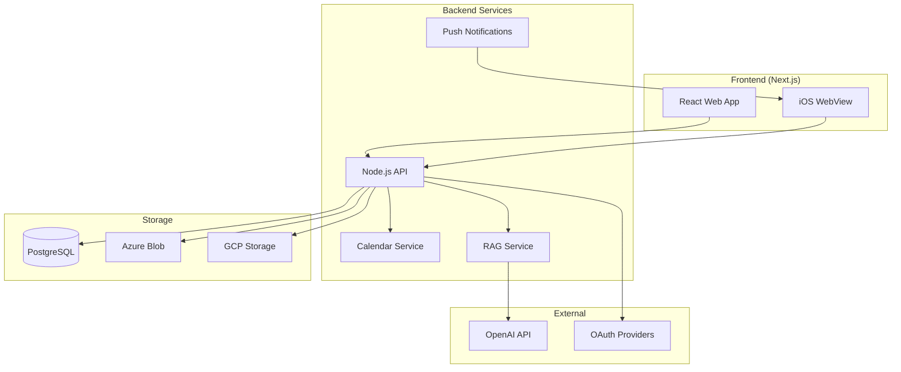

---

## Navigation Structure

The app uses a bottom tab bar with 4 main sections plus a floating action button for quick creation.

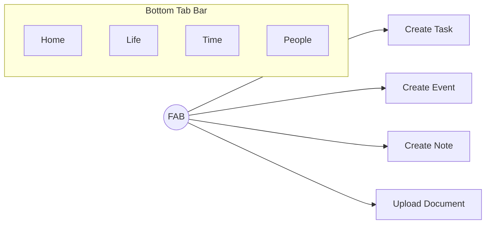

### Main Tabs

| Tab | Route | Purpose |
|-----|-------|---------|
| **Home** | `/home` | Dashboard with Today/What's Next, Pinned items, Recent Activity |
| **Life** | `/life` | Hexagonal grid interface for spaces, appliances, utilities |
| **Time** | `/time` | Calendar view for events and tasks with deadlines |
| **People** | `/people` | Contact management and family members |

---

## Authentication Flow

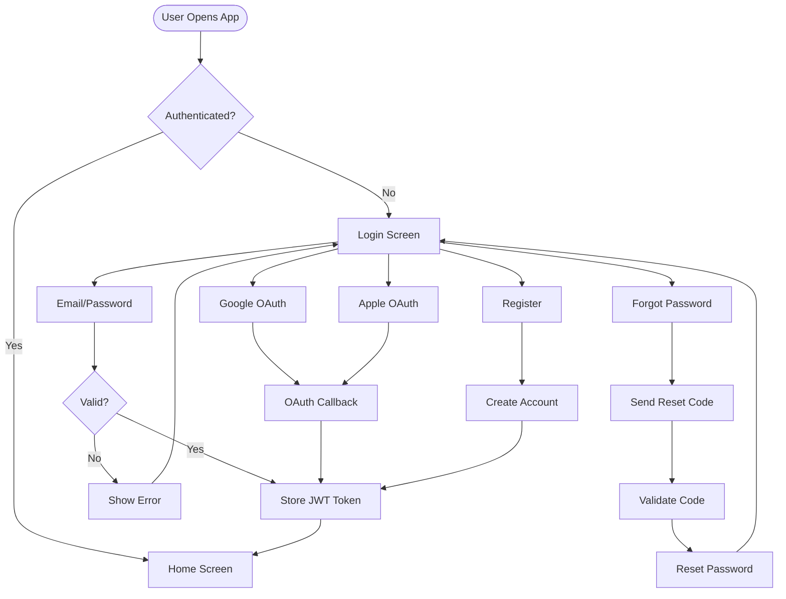

### Auth Screens

| Screen | Route | Purpose |
|--------|-------|---------|
| Login | `/login` | Email/password + OAuth (Google/Apple) |
| Register | `/register` | New user signup |
| Forgot Password | `/forgot-password` | Request reset code |
| Validate Code | `/validate-code` | Enter verification code |
| Reset Password | `/reset-password` | Set new password |
| OAuth Callback | `/oauth-callback` | Handle OAuth redirects |

---

## Core Concepts: DENTS

DENTS is the unified term for the four core content types:

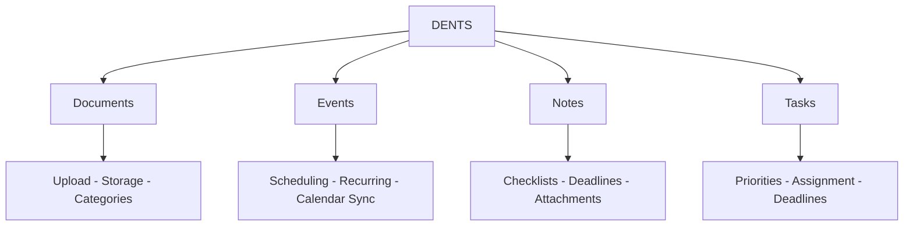

### DENT Entity Relationships

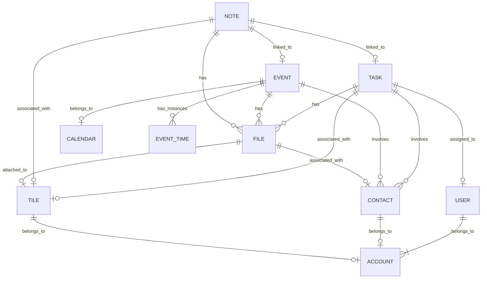

---

## Hive System (Household Management)

The Hive system organizes family members into households for shared management.

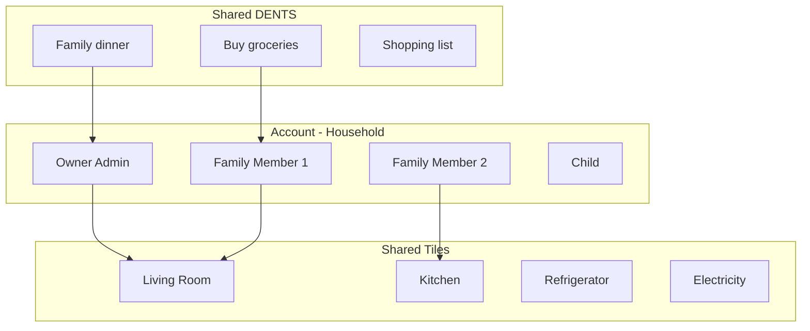

### Tile Types

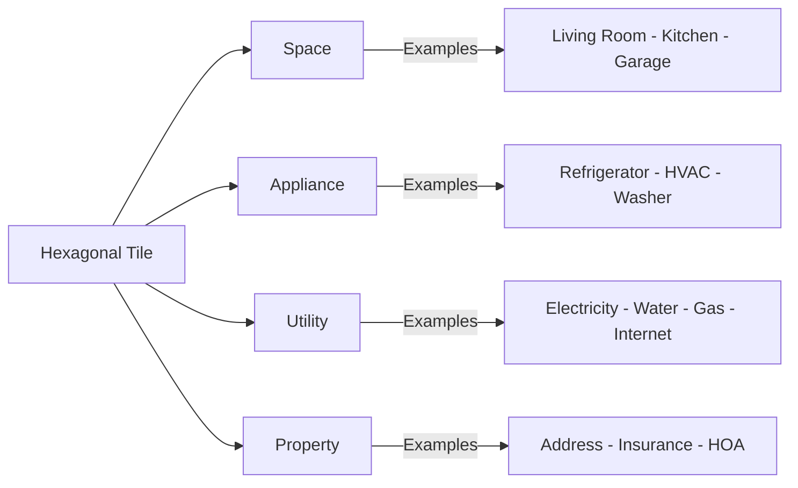

---

## Screen Flow Diagrams

### Home Tab Flow

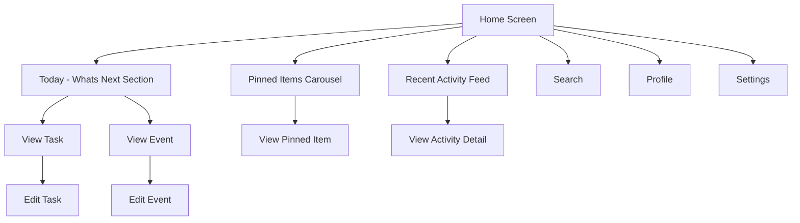

### Life Tab Flow (Hex Grid)

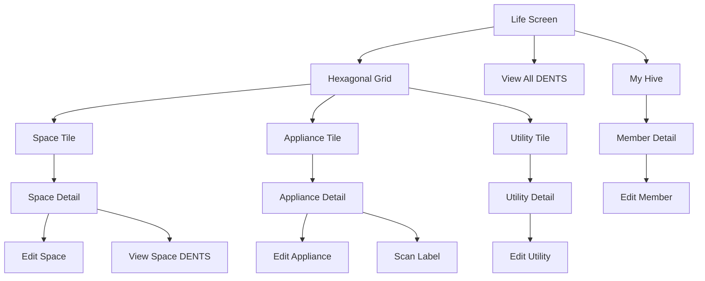

### Time Tab Flow (Calendar)

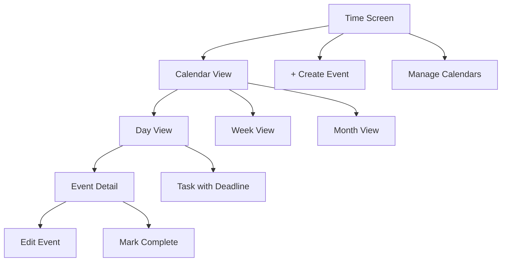

### People Tab Flow

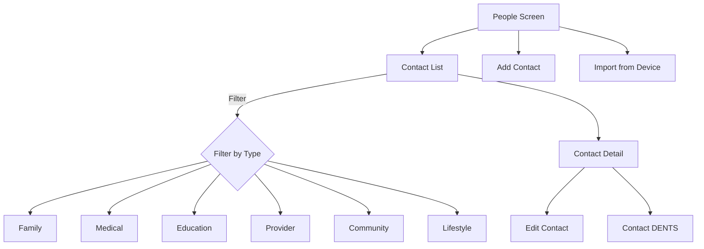

### Create/Edit DENT Flow

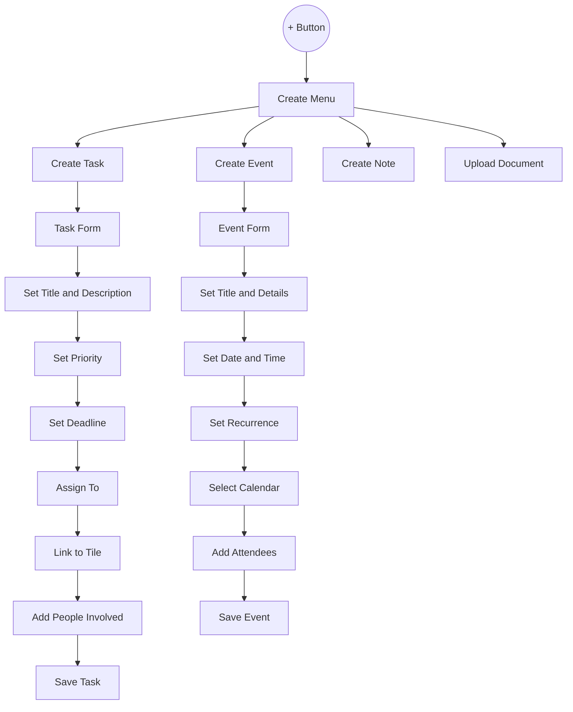

---

## Design System

### Color Palette

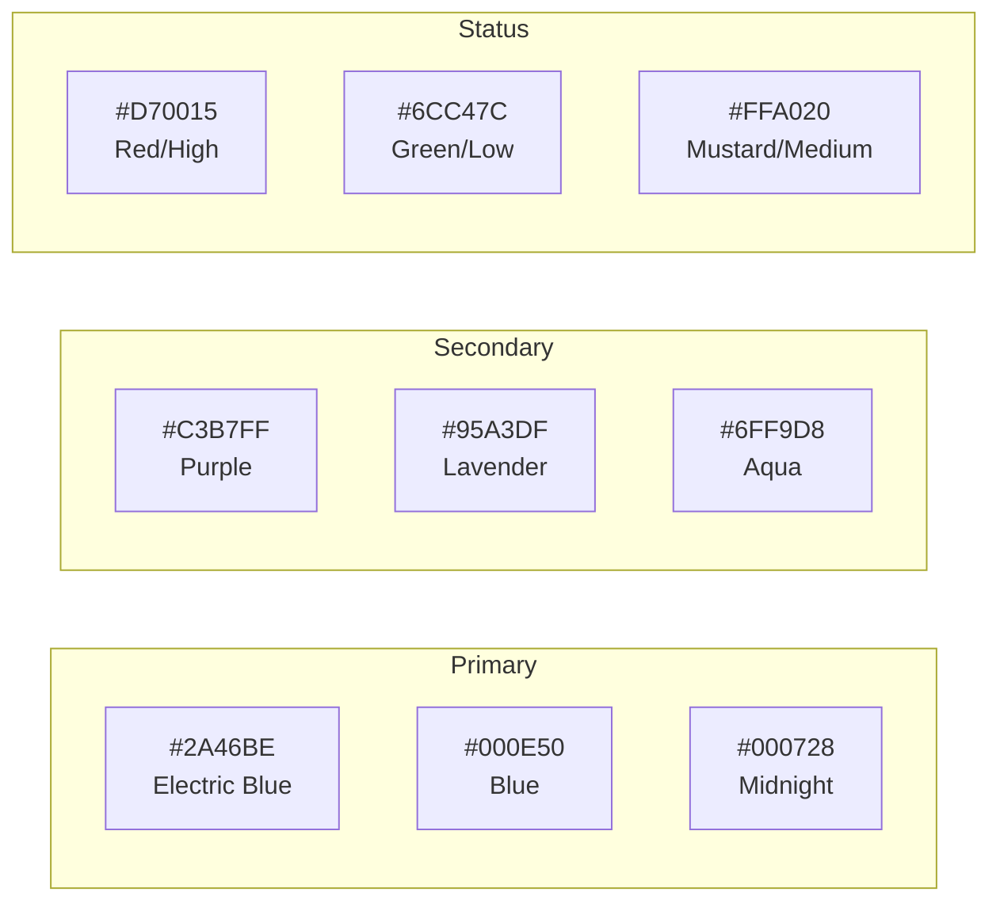

### Priority Color Coding

| Priority | Color | Hex |
|----------|-------|-----|
| None | Grey | `#BABACA` |
| Low | Green | `#6CC47C` |
| Medium | Mustard | `#FFA020` |
| High | Red | `#D70015` |

### Typography

- **Primary Font:** Poppins (Regular, Medium, Semibold, Bold)
- **Secondary Font:** ABeeZee (Regular, Italic)
- **Size Range:** 8px - 50px

---

## UI Components

### Component Library

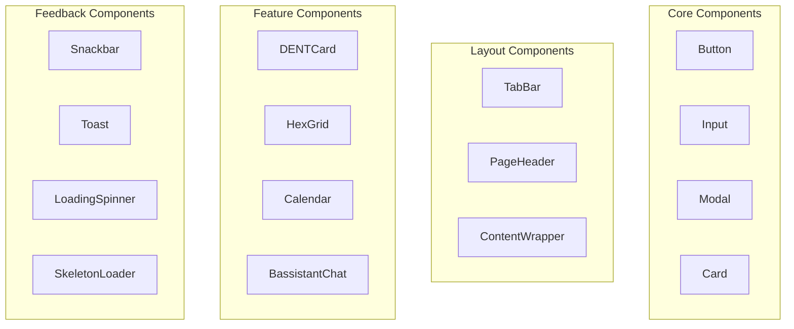

### Modal Types

| Modal | Purpose |
|-------|---------|
| `UserSelectionModal` | Select family members |
| `HiveSelectionModal` | Select household |
| `ApplianceSelectionModal` | Select appliances |
| `DocumentUploadModal` | Upload files |
| `TextInputsModal` | Multi-field text input |
| `DateTimeSelectionView` | Date/time picker |
| `PrioritySelectionView` | Priority selector |

### Notification System

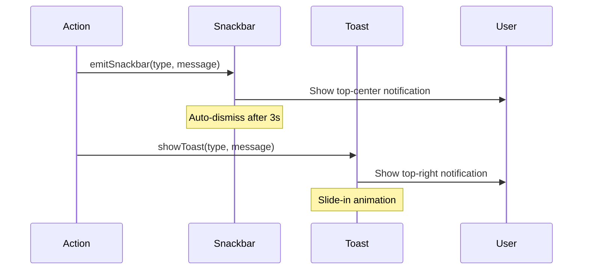

---

## AI Features (tenant)

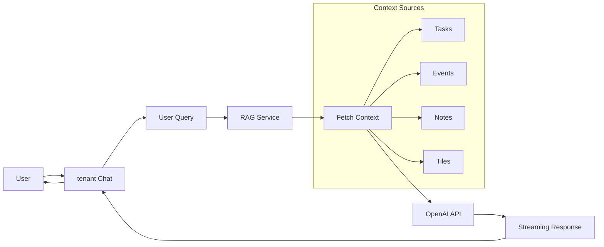

**tenant AI chat Features:**
- Natural language queries about home management
- Context-aware responses using household data
- Streaming responses for real-time feedback
- Accessible via chat interface at `/assistant-chat`

---

## Data Flow

### State Management (Zustand)

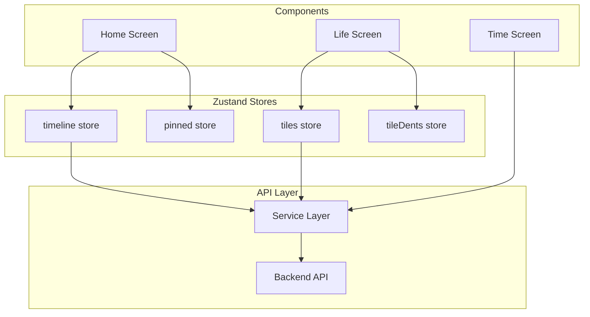

### API Response Flow

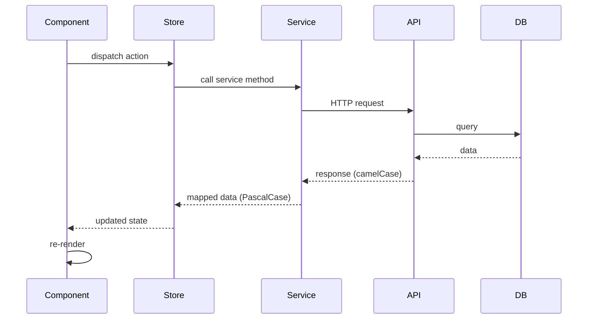

---

## Key User Flows

### Adding a New Task

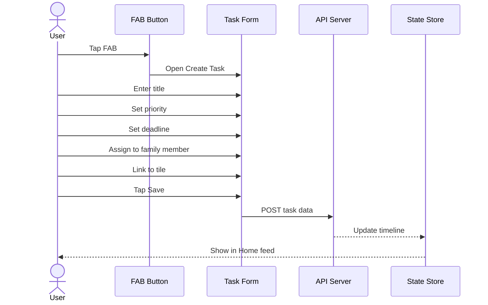

### Managing Appliances

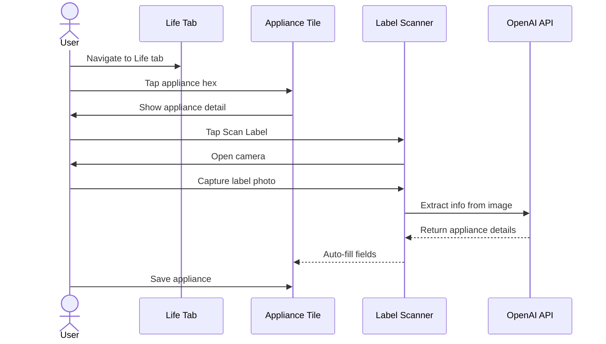

---

## Screen Inventory

### Main Screens

| Category | Screen | Route |
|----------|--------|-------|
| **Auth** | Login | `/login` |
| | Register | `/register` |
| | Forgot Password | `/forgot-password` |
| **Tabs** | Home | `/home` |
| | Life | `/life` |
| | Time | `/time` |
| | People | `/people` |
| **Tasks** | Create Task | `/create-task` |
| | Edit Task | `/edit-task/[id]` |
| | View Task | `/view-task/[id]` |
| **Events** | Create Event | `/create-event` |
| | Edit Event | `/edit-event/[id]` |
| | View Event | `/view-event/[id]` |
| **Notes** | Create Note | `/create-note` |
| | Edit Note | `/edit-note/[id]` |
| | View Note | `/view-note/[id]` |
| **Documents** | Create Document | `/create-doc` |
| | Edit Document | `/edit-document` |
| | View Document | `/document-viewer` |
| **Tiles** | Tile Detail | `/tile/[id]` |
| | Spaces | `/spaces` |
| | Space Detail | `/space-detail/[id]` |
| | Appliances | `/appliances` |
| | Appliance Detail | `/appliance-detail/[id]` |
| | Utilities | `/utilities` |
| | Utility Detail | `/utility-detail/[type]` |
| **People** | Contact Detail | `/people/[id]` |
| | New Contact | `/people/new` |
| | Edit Contact | `/people/[id]/edit` |
| **Hive** | My Hive | `/my-hive` |
| | Member Detail | `/my-hive/member/[id]` |
| | Hive Selection | `/hive-selection` |
| **Settings** | Settings | `/settings` |
| | Profile | `/profile` |
| | Edit Profile | `/profile/edit` |
| **Other** | Search | `/search` |
| | tenant Chat | `/assistant-chat` |
| | Calendars | `/calendars` |

---

## Mobile App Integration

The web app supports WebView integration with the native iOS app:

```mermaid
graph TB
    subgraph iOS["iOS Native App"]
        NativeNav[Native Navigation]
        NativeTabBar[Native Tab Bar]
        WebView[WKWebView]
    end
    
    subgraph Web["Next.js Web App"]
        Pages[Page Components]
        TabBarComp[TabBar Component]
        AuthGuard[Auth Guard]
    end
    
    NativeNav --> WebView
    WebView --> Pages
    
    Pages --> |mobile=true| HideWebTabBar[Hide Web Tab Bar]
    Pages --> |token=jwt| AuthGuard
    
    NativeTabBar --> WebView
```

**Mobile-specific behaviors:**
- Tab bar hidden when `?mobile=true` (uses native iOS tab bar)
- JWT token passed via `?token=` parameter
- Navigation preserves mobile parameters across routes

---

## Recurring Patterns

The app supports recurring tasks and events using RRule:

```mermaid
graph LR
    Recurrence[Recurrence Pattern]
    
    Recurrence --> Daily[Daily]
    Recurrence --> Weekly[Weekly]
    Recurrence --> Monthly[Monthly]
    Recurrence --> Yearly[Yearly]
    Recurrence --> Custom[Custom RRule]
    
    Event --> |has| EventTimes[Event Times]
    EventTimes --> |instances| Instance1[Instance 1]
    EventTimes --> Instance2[Instance 2]
    EventTimes --> InstanceN[Instance N...]
```

---

## Summary

Tenant is a comprehensive family management app with:

- **4 main tabs:** Home, Life, Time, People
- **Core content types (DENTS):** Documents, Events, Notes, Tasks
- **Hive system:** Multi-user household management
- **Tile-based organization:** Hexagonal grid for spaces, appliances, utilities
- **AI assistant (tenant):** Context-aware home management help
- **Cross-platform:** Web + iOS native app integration
- **Custom design system:** Consistent UI with Poppins font, blue/purple color palette
